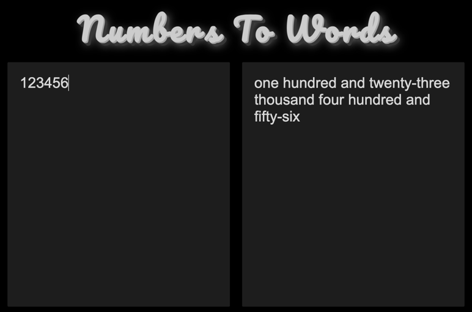

WINTER HOMEWORK EXTRAVAGANZA SPECIAL

_JavaScript Basic Homework_

# Hangman [level: hard]

During the holidays, we all love to play games, don’t we? Why not create one yourselves and practice all the cool things you’ve learned so far? So let’s get started with a good old classic.

Create a web page that will allow the user to play the hangman game against the computer.

The rules of hangman are this:

- We have to guess a word by guessing individual letters. We have a set number of lives and lose a life each time we make a wrong guess.

It's a game where the unknown word is displayed as dashes, with letters fill in as we guess them.

Thinking about this programmatically, we can see that the state of the game at any time can be represented through the use of a limited number of variables and operations on these variables.

- At the start of the game we choose a word to be guessed. The word will be a random choice from the program out of a many options that are saved in the game. You can choose certain topic e.q. movies / TV shows.

- We also have a number of lives, which is the total number of wrong guesses we are allowed. You set this in advance (it usually is 6 – for each part of the hangman itself (head, body, 2 arms, 2 legs). You lose a life when you have a wrong guess.

- Finally, we have our guesses, the letters that we have guessed so far. Dashes are replaced with the guessed letters.

- The game has three possible states - Victory (all letters guessed), Death (no more lives left) or Still Playing. All of these can be figured out using the above three variables.

It's worth emphasizing that the lives, or maximum number of wrong guesses, and the word are set at the start of the game. The only thing that changes throughout the course of a game is the guessed letters, and everything else follows on from that.

**BONUS**: A sketch of the scaffold is added to each time there's a wrong guess. If the sketch is completed before we complete the game, then we lose!

# Number to Words Converter [level: medium]

## Objective
Convert numeric input to word representation for numbers 0-1,000,000

## Technical Requirements
- Support whole numbers only
- Number range handling:
    - Single-digit numbers (0-9)
    - Teen numbers (10-19)
    - Tens (20-90)
    - Hundreds
    - Thousands
    - Hundreds of thousands
    - Millions

## Conversion Rules
- English number naming conventions
- Grammatically correct structure

## Input Validation
- Reject non-numeric inputs
- Limit to 0-1,000,000
- Clear error messaging

## Test Cases
- `0` → "zero"
- `13` → "thirteen"
- `45` → "forty-five"
- `100` → "one hundred"
- `1,234` → "one thousand two hundred thirty-four"
- `999,999` → "nine hundred ninety-nine thousand nine hundred ninety-nine"

See this [example](https://lingojam.com/NumbersToWords).

# Standard Calculator [level: easy]

Now it’s time for some more challenges! Create a web calculator with all the standard features.

- The calculator should have buttons for the numbers to click (just like calculators in real life, no inputs!).
- It should have buttons for the operations: Sum, Subtract, Multiply and Divide.
- It should also have the standard buttons equals, decimal dot and reset ( C ).
- There should be a display where we can see the numbers that we are entering and results (like calculators in real life).
- The calculator should show error message if number is too large or if we are dividing by zero.

**NOTE:** The eval() function is not allowed!

# Information on the homework

Contact: stojanovska_tijana@outlook.com
         muratkoca137@gmail.com

**Good luck and happy coding!**
